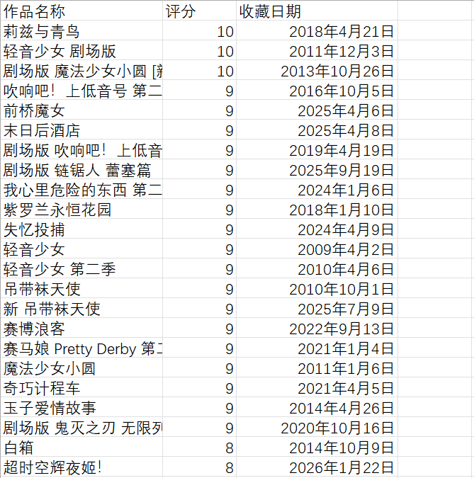
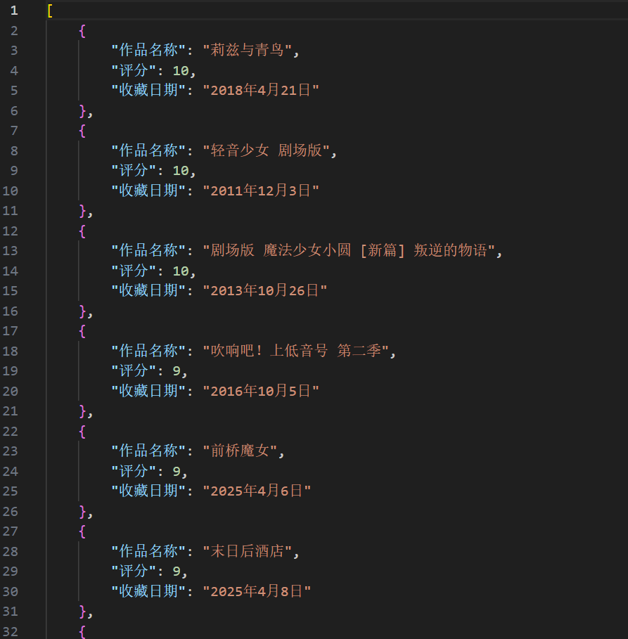
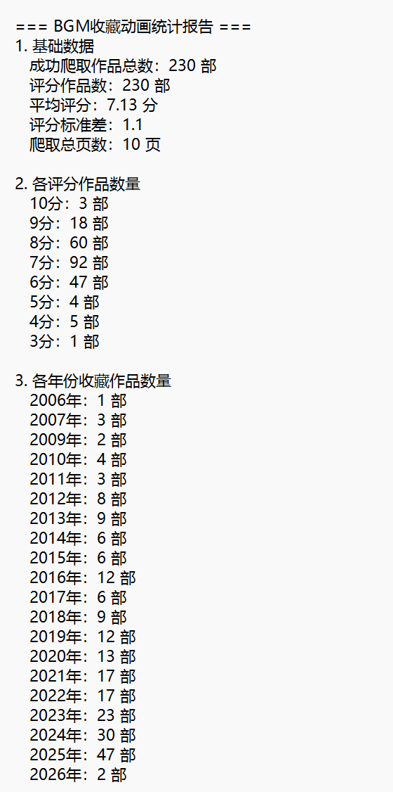

# bangumi-crawl
bangumi 网站用户收藏/看过动画条目爬取、导出及简单统计工具，用于自行进行一些后续统计分析

## 功能
- 爬取指定用户的 bangumi 收藏/看过动画列表；
- 支持导出为 Excel/CSV 格式；
- 附简单的数据分析（如评分统计、日期分布）。

## 使用方法
### 普通用户
1. 下载 Release 中的 `bgm_crawl.exe`；
2. 双击运行，输入爬取 bangumi 用户 ID，点击开始爬取；
3. 等待爬取完成，结果会保存在桌面上。

### 输出效果
1. excel文件
    
2. json文件
    
3.简单分析text文件
    
   
### 开发者（需要 Python 环境）
1. 克隆仓库：`git clone https://github.com/baige7572-coder/bangumi-crawl.git`；
2. 安装依赖：`pip install -r requirements.txt`；
3. 终端运行：`pyinstaller -F -w bgm_crawl.py`。

## 注意事项
- 请勿高频爬取，避免触发 bangumi 反爬机制；
- 爬取失败或较慢可能因为网速，可自行更换网络重试。
